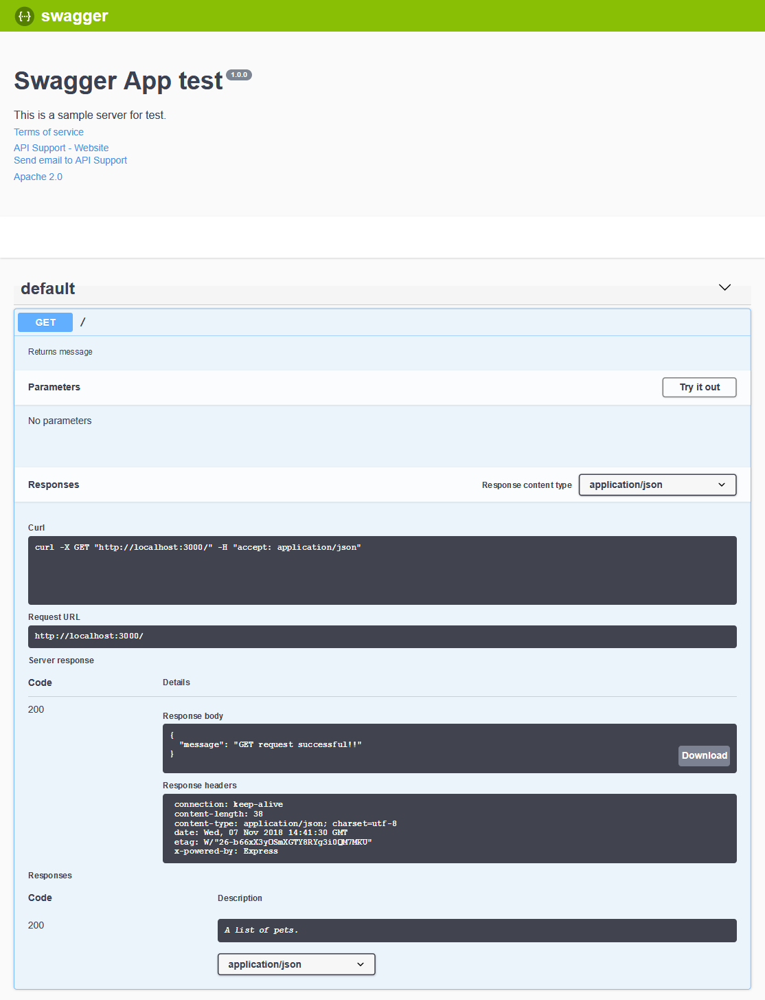

# Express server with TypeScript and Swagger

The server is based on Express.js with Typescript on top. It enables the use of types. 

# Installation

Install Node.js using either a [package manager](https://nodejs.org/en/download/package-manager/) or an [installer](https://nodejs.org/en/download/current/).

Clone this repository and install the dependencies
    
    Install Node.js
    Install yarn
    Clone this repository
    npm install


# Starting app

```
$ yarn dev
```

# Learning

I use the tuto.
Create simple api rest :   
> https://blog.morizyun.com/blog/typescript-express-tutorial-javascript-nodejs/index.html

Install and read documention Swagger UI Express :
> https://www.npmjs.com/package/swagger-ui-express

**&**

>https://swagger.io/specification/

Auto generate swagger.json
> https://www.rajram.net/node-101-part-4-auto-generate-and-register-routes-in-node-for-web-apis-2/

**&**

> https://www.rajram.net/node-101-part-5-auto-generate-swagger-for-your-web-api-and-use-swaggerui-to-try-it-out/

# Preview
